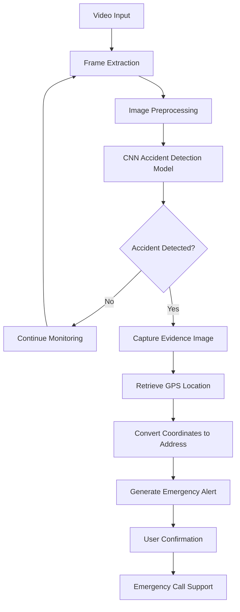

# 🚨 AccidentSense
🎥 Live Prototype Demo:[AccidentSense](https://drive.google.com/drive/folders/1vrsMNyy4rV546eEptIo83RkDn6v0wnUd?usp=sharing)
### AI-Powered Road Accident Detection & Emergency Alert System

AccidentSense is an intelligent road safety system that leverages Computer Vision and Deep Learning to automatically detect road accidents from video streams and initiate emergency response workflows. The system analyzes video frames in real time using a Convolutional Neural Network (CNN), captures accident evidence, retrieves location information, and assists in generating emergency alerts.

---

## 📌 Project Overview

Road accidents remain one of the leading causes of fatalities worldwide. Delays in emergency response can significantly increase the severity of injuries and loss of life.

AccidentSense aims to reduce response time by:

* Detecting accident events automatically from video footage.
* Capturing accident snapshots for evidence.
* Retrieving accident location information.
* Generating emergency alerts.
* Assisting users in initiating emergency response actions.

---

## ✨ Key Features

### 🔍 Real-Time Accident Detection

* Processes video streams using OpenCV.
* Uses a Deep Learning model to classify accident and non-accident scenarios.
* Performs frame-by-frame accident prediction.

### 📸 Automatic Evidence Capture

* Captures and stores accident images when an accident is detected.
* Maintains timestamp-based records for future analysis.

### 📍 Location Tracking

* Retrieves predefined GPS coordinates.
* Converts latitude and longitude into a human-readable address using reverse geocoding.

### 🚑 Emergency Response Support

* Displays an accident alert popup.
* Allows users to initiate emergency calls.
* Integrates with Twilio APIs for automated communication workflows.

### 🧠 Deep Learning-Based Classification

* Custom CNN architecture built using TensorFlow/Keras.
* Multi-layer convolutional neural network for accident classification.

---

## 🏗️ System Workflow



## 🛠️ Tech Stack

### Programming Language

* Python

### Machine Learning & Deep Learning

* TensorFlow
* Keras
* NumPy

### Computer Vision

* OpenCV

### Location Services

* Geopy
* Nominatim

### Communication Services

* Twilio API

### Development Tools

* Jupyter Notebook
* Git
* GitHub

---

## 📊 Model Performance

### Evaluation Results

| Metric               | Value |
| -------------------- | ----- |
| Accuracy             | 88%   |
| Precision (Accident) | 57%   |
| Recall (Accident)    | 6%    |
| F1-Score (Accident)  | 11%   |

### Confusion Matrix

| Actual / Predicted | No Accident | Accident |
| ------------------ | ----------- | -------- |
| No Accident        | 460         | 3        |
| Accident           | 62          | 4        |

The model demonstrates strong performance for identifying non-accident scenarios while highlighting opportunities for improving accident recall through dataset balancing, threshold tuning, and model optimization.

---

## 📂 Project Structure

```text
AccidentSense/
│
├── camera.py
├── detection.py
├── evaluate_model.py
├── model.json
├── config.json
├── accident-classification.ipynb
├── .gitignore
└── README.md
```

---

## 🚀 Future Enhancements

* Live CCTV integration for real-time accident monitoring.
* Training on a properly balanced dataset to improve accident detection performance and reduce class imbalance issues.
* Implementing robust object detection models such as YOLO for more accurate and efficient accident detection.
